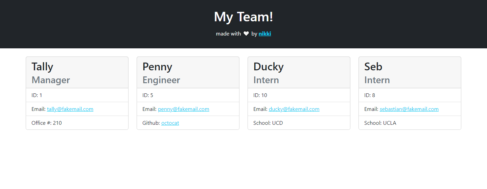

# Module #10 Challenge: Team Profile Generator

## Description

This project is a **team profile generator** that uses **NodeJS**, **npm Inquirer**, **Jest**, and **Bootstrap**. After the user answers the series of prompts, an HTML file displaying the manager and the rest of team members will we written to `dist > team.html`.

[Click HERE to view the project demonstration video!]()

## Table of Contents

* [Installation](#installation)
* [Usage](#usage)
* [Tests](#tests)
* [Questions](#questions)


## Installation

To install necessary dependencies, run the following command in the root directory of this project:
```
npm i
```

## Usage

In the root directory of the project, run the following command to start a series of prompts:
```
node index
```

Example of a generated Team Profile:



## Tests

To run tests, run the following command:
```
npm run test
```

## Questions

If you have any questions about this repository, please open an issue. You can also find more of my work at [desguerra](https://github.com/desguerra) on GitHub.